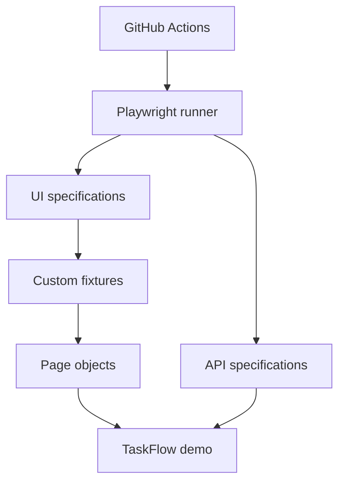

# Playwright Automation Framework

A production-style **TypeScript + Playwright** portfolio project demonstrating reliable UI, API, mobile, cross-browser and accessibility testing. It includes a self-contained TaskFlow application and API so the test suite is deterministic and does not depend on third-party websites.

## What this demonstrates

- Page Object Model with dependency-injected fixtures
- UI and REST API testing in one framework
- Chromium, Firefox and mobile emulation projects
- Accessibility validation with axe-core
- Parallel execution, retries and failure diagnostics
- HTML, JUnit and GitHub Actions reporting
- Screenshots, video and Playwright traces on failure
- Stable role/test-id locators and web-first assertions
- Docker and GitHub Actions execution
- Test tagging such as `@smoke`

## Architecture



## Project structure

```text
demo/                 deterministic web application and REST API
fixtures/             reusable Playwright fixtures
pages/                page objects and user actions
tests/ui/             browser and accessibility specifications
tests/api/            API contract and negative-path specifications
.github/workflows/    CI pipeline
playwright.config.ts  projects, retries, artifacts and reporting
```

## Run locally

Requirements: Node.js 20+

```bash
npm ci
npx playwright install
npm test
```

Useful commands:

```bash
npm run test:smoke
npm run test:ui
npm run test:api
npm run test:headed
npm run typecheck
npm run report
```

The configured `webServer` starts and stops TaskFlow automatically.

## Run with Docker

```bash
docker build -t playwright-portfolio .
docker run --rm playwright-portfolio
```

## Reliability strategy

- Prefer accessible roles and explicit test IDs over CSS/XPath selectors.
- Use Playwright's web-first assertions instead of fixed sleeps.
- Keep the demo service local so network and third-party data cannot create flakes.
- Generate unique test data for each write scenario.
- Capture traces on retry and retain video/screenshots only when useful.
- Keep retries enabled only in CI so local failures remain visible.

## CI evidence

Every pull request runs type checking and the complete cross-browser suite. The HTML report is uploaded for 14 days even when tests fail, making failures diagnosable without rerunning them locally.

## Next extensions

- Add authenticated storage-state fixtures
- Add visual-regression baselines
- Add database setup/cleanup fixtures
- Publish trend data to a test analytics dashboard
