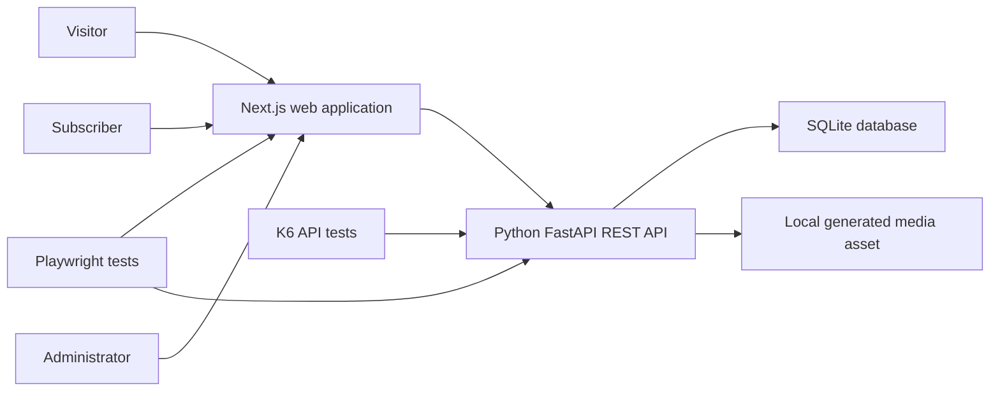

# StreamForge System Design

**Status:** Accepted for MVP implementation  
**Requirements:** [StreamForge Product Requirements](streamforge-requirements.md)

## 1. Design Goals

StreamForge is a small, locally controlled streaming-style application whose main purpose is production-grade quality engineering. The design favors deterministic behavior, explicit contracts, test isolation, and simple operation over production scale.

## 2. System Context



The browser never accesses the database directly. All authentication, authorization, validation, ownership, and state transitions are enforced by the API.

## 3. Runtime Components

### Web application

- Next.js App Router provides public landing, plans, and sign-in routes.
- Protected catalog, details, watchlist, profiles, plans, and player routes.
- Administrator catalog-management routes.
- Semantic HTML and accessible controls are the primary automation contract.
- URL query parameters preserve catalog search, filter, and sort state.
- Next.js does not implement duplicate business APIs; FastAPI remains the backend authority.

### API

- Versioned JSON routes under `/api/v1`.
- Cookie-based sessions and role-based authorization.
- Catalog, watchlist, profile, plan, playback, and administration operations.
- Consistent errors containing `code`, `message`, `correlationId`, and optional `fields`.
- Liveness at `/health/live` and dependency-aware readiness at `/health/ready`.
- Test-support routes enabled only in `local`, `test`, and `ci` environments.

### Persistence

- SQLite stores users, password hashes, sessions, profiles, plans, titles, watchlists, and playback authorization state.
- A checked-in migration and deterministic seed process establish the baseline.
- Database files persist through normal service restarts.
- Tests use a database file per Playwright worker to prevent shared mutable state.

### Simulated player

- A locally generated, repository-owned video asset avoids network and copyright dependencies.
- Native media events drive loading, playing, paused, ended, seeking, volume, and captions state.
- Playback authorization is requested from the API before the player opens.

## 4. Primary Request Flows

### Sign-in

1. The web application submits email and password to the API.
2. The API verifies the password hash and creates a server-side session.
3. The API returns an HTTP-only session cookie.
4. Protected requests resolve the session and apply role checks.
5. Sign-out deletes the session and expires the cookie.

### Catalog discovery

1. The web application reads search, filter, and sort values from the URL.
2. It requests `/api/v1/titles` with those values.
3. The API applies publication and subscriber-visibility rules before filtering and sorting.
4. The response returns a deterministic collection envelope and result count.

### Watchlist mutation

1. The API identifies the subscriber from the session, never from a client-supplied user ID.
2. A unique database constraint makes additions idempotent.
3. The web application updates the visible state after the API succeeds.

### Plan change and playback

1. A confirmed plan change updates entitlement immediately.
2. Playback authorization evaluates authentication, availability, maturity limit, and plan tier.
3. An allowed response opens the local simulated player; a denial returns an explicit reason.

### Catalog administration

1. Admin middleware rejects visitors and subscribers.
2. Create and update operations validate the documented title schema.
3. Publish state determines subscriber visibility immediately.
4. Optimistic concurrency is deferred beyond MVP.

## 5. Data Model

| Entity | Essential fields and constraints |
|---|---|
| User | stable ID, email unique, password hash, role, plan ID |
| Session | opaque ID, user ID, expiry |
| Profile | stable ID, user ID, unique name per user, avatar, maturity limit, active flag |
| Plan | stable ID, name, price, quality, stream limit, tier rank |
| Title | stable immutable ID, name, synopsis, type, genres, rating, year, media metadata, image, availability, tier, published, created time |
| Watchlist | user ID and title ID composite unique key |

## 6. Test-Support Design

- `POST /api/v1/test/reset` recreates the deterministic baseline for the caller's worker database.
- A required worker identifier selects an already configured test database; it cannot supply an arbitrary file path.
- Fault state is scoped by worker and endpoint and supports latency, HTTP error, empty response, malformed response, and playback error.
- Test-support routes are absent in `production-like` mode.
- API-assisted sign-in uses the real authentication and session path.

## 7. Operability

- `docker compose up --build` starts the complete local system after applying migrations and seed data.
- Docker Compose provides the reproducible container path without an external database service.
- Configuration is read from environment variables and validated at startup where required.
- API logs are structured JSON with secrets and authorization values excluded.
- Playwright retains traces, screenshots, video, and application logs for failures.
- Graceful shutdown stops new requests, closes the HTTP server, and closes the database connection.

## 8. Repository Shape

```text
apps/
  api/
  web/                 # Next.js App Router
packages/
  test-data/
tests/
  accessibility/
  api/
  e2e/
  fixtures/
  performance/
*.md                    # Requirements, architecture, ADRs, and epics
```

Code is added only when required by a traced requirement. Shared packages contain genuinely reused stable test data, not speculative abstractions. OpenAPI is the contract between the Python API and TypeScript clients.

## 9. Security Boundaries

- The API is the authorization boundary.
- Passwords are hashed and never returned or logged.
- Session identifiers use HTTP-only cookies with environment-appropriate secure settings.
- Administrative and test-support permissions are checked independently.
- User-owned records are selected through the authenticated user ID.
- CORS allows only the configured web origin.
- Production-like mode enables authentication rate limiting and disables test support.

## 10. Verification Strategy

| Layer | Scope |
|---|---|
| API | schemas, status semantics, authorization, ownership, validation, state transitions |
| Playwright UI | twelve acceptance scenarios and critical Chromium, Firefox, and WebKit journeys |
| Accessibility | axe checks plus documented keyboard and screen-reader review |
| Performance | K6 API smoke and nominal profiles only |
| Contract | OpenAPI validation in MVP; full consumer/provider verification after MVP |
| Security | dependency audit, headers, session behavior, role and ownership tests |
